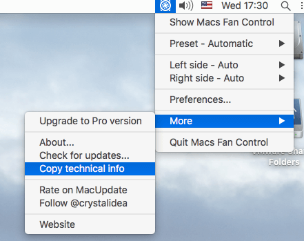
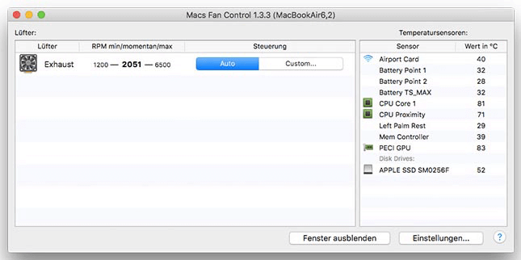

You you'd like to report a bug or on issue using the app, please include

- Technical information from the menu "More" -> "Copy technical info":

- Screenshot of the main window of Macs Fan Control (completely visible as it's on the example below).

Info on creating screenshots on [macOS](http://www.wikihow.com/Take-a-Screenshot-in-Mac-OS-X), on [Windows](http://www.wikihow.com/Take-a-Screenshot-in-Microsoft-Windows).

